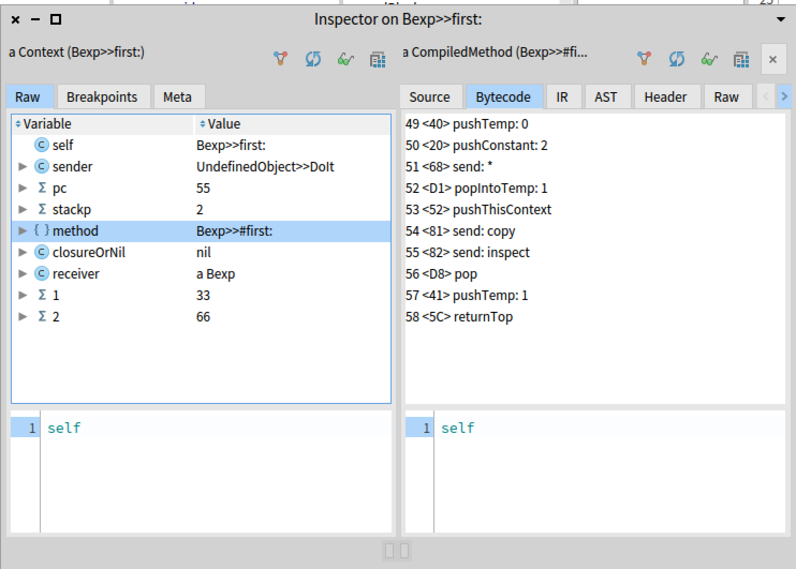

# Block in Smalltalk


2022-09-29

《Deep Into Pharo》读书笔记。

Lexically-scoped block closures 是Smalltalk中的基础，用于分支、循环等的实现。Smalltalk中分支与循环是通过Library的方式实现的，而不是内置于语言实现的。

重点：
- 在运行时，block 可以访问的变量被bound 在`定义它的Context`，而不是运行它的Context。
- 临时变量编译时进行分析，block中引用的会标记 escapingWrite ，在heap 上分配
- non-local return , 执行时退到创建block 的home context 的执行点。
- context 表示程序执行点的状态
- outerContext， thisContext， home
- message 的执行过程
- doesNotUnderstand:
- stack frame
- remote variable

## 14.1 Basic
Block: Lambda表达式 + 创建时的environment .

想象Block 是个匿名函数或方法，一段代码，执行被冻结，并可以通过消息执行。

### 创建Block：
```smalltalk
[1 + 2]
```

### 执行一个block： （使用 value, value: 。。。）

```smalltalk
[ :x | x + 3 ] value: 2 "5"
```

### 其它执行方法：
- cull:  可以多给参数
- valueWithPossibleArgs:  可以少给参数，少的填充 nil

### 性能相关
- bench 性能测试
- durationToRun  执行时长
- timeToRun


```smalltalk
[ 100 factorial  ] bench "'175411.753 per second'"
[ 10000 factorial ] bench. "'51.487 per second'"
[ 100000 factorial ] durationToRun  "0:00:00:03.686".
```

### Error handling
- ensure: terminationBlock  无论block执行结果如何都执行 terminationBlock
- ifCurtailed: onErrorBlock block执行不成功时执行 onErrorBlock
- on: exception do: catchBlock  类似 try/catch Exception
- on: exception fork: catchBlock  fork process 来处理异常，原有的进程继续执行，返回nil. context stack transfer to forked process。 （TODO）


```smalltalk
[ 1/0 ] ensure: [ Transcript show: 'done' ].
```
执行时会弹出 debugger ，关掉后会继续执行后面的 block。

```smalltalk
[ self error: 'err' ] on: Error fork: 
   [ :ex | Transcript show: 'handle in new process' ]. "nil"
```


#### on: exception fork: catchBlock 的详细分析

### process scheduling, concurrent
- fork  create and schedule a process
- forkAt: aPriority
- newProcess  create, not schedule a process


## 14.2 Variable and blocks
local variable: Block 可以有自己的临时变量，在block每次执行时初始化，并且是block local 的。

non-local variable

A block will close over the external variables it uses. It means that even if the block is executed later in an environment that does not lexically contain the variables used by a block, the block will still have access to the variables during its execution. 

self, instance variables, method temporaries and arguments 私有变量是lexically scoped。

在运行时，block 可以访问的变量被bound 在**定义它的Context (block home context)，而不是运行它的Context**。


> At runtime, the variables that a block can access, are bound (get a value associated to them) in the context in which the block that contains them is defined, rather than the context in which the block is evaluated. 

### Context 的概念
表达程序的执行。在其它语言中有称为 Stack frame, Activation Record。
表达当前的执行步骤的信息：从哪个context来的，下一个 byte code，临时变量等。


#### 实验

##### Variable lookup

```smalltalk
Bexp>>setVarAndDefineBlock

	| t |
	t := 42.
	^ self evalBlock: [ t * 2 ]

Bexp>>evalBlock: aBlock

	| t |
	t := nil.
	^ aBlock value
```

执行：

```smalltalk
Bexp new setVarAndDefineBlock . "84"
```

setVarAndDefineBlock 时创建一个 block，此时block中的 t 指向的是创建时的变量 t，值为 42 。 

evalBlock: aBlock 执行时，临时变量 t := nil ，但并不影响 block 内的 t ，因此最后结果是 84.


context, sender , setVarAndDefineBlock 被执行时，创建一个 context，在里面调用 evalBlock: ，此时 evalBlock： 的 context 对象中 sender指向之前调用它的context (setVarAndDefineBlock的)。

aBlock 的 home Context 指向创建它时的 context。
**non-local variable 在 home context中查找。**

##### Changing a variable value

```smalltalk
setVarAndDefineBlock2

	| t |
	t := 42.
	^ self evalBlock: [ 
		  t := 33.
		  t * 2 ]

Bexp new setVarAndDefineBlock2. "66"
```

在 block 中，可以修改 non-local variable 的值。

##### Accessing a shared non-local variable

多个 block 可以共享一个 non-local variable， 并在不同时刻修改它的值。（并发噩梦，小心使用）

**block 不会 copy 捕获的变量的值。而是指向变量的位置。**

##### Vairable lookup is done at execution time

变量是在执行时进行查找，而不是在block创建时复制值。

添加instance variable : block
```smalltalk
setVarAndDefineBlock4

	| t |
	t := 42.
	block := [ t traceCr: t ].
	t := 69.
	self evalBlock: block
```

block 创建时，指向 t 。 执行时，t 已经改变了，输出的是改变后的值。

##### For method arguments

指向创建时的 argument

##### self binding

创建两个Class， 在一个class obj 中创建block 并在另一个class obj 中执行。可以看到，self 也被捕获。

### Block-local variable

#### block allocation
```smalltalk
blockLocalTemp

	| collection |
	collection := OrderedCollection new.
	#( 1 2 3 ) do: [ :index | 
		| temp |
		temp := index.
		collection add: [ temp ] ].
	^ collection collect: [ :each | each value ]

Bexp new blockLocalTemp. "an OrderedCollection(1 2 3)"
```

collection 中包含3个 [temp] block，每个 temp 指向创建时的变量，3个都不一样，最后得到 #(1 2 3)。

#### method allocation

```smalltalk
blockOutsideTemp

	| collection temp |
	collection := OrderedCollection new.
	#( 1 2 3 ) do: [ :index | 
		temp := index.
		collection add: [ temp ] ].
	^ collection collect: [ :each | each value ]

Bexp new blockOutsideTemp. "an OrderedCollection(3 3 3)"
```

temp 是 block 外部的变量，因此 3个 [temp] 指向的是同一个 temp，最后得到的是  #(3 3 3).

## 14.3 Variables can outlive their defining method

*outlive* : block 中指向的 non-block local variables 会继续存在，即使method 执行结束。


```smalltalk
foo

	| a |
	[ a := 0 ] value.
	^ a

Bexp new foo. "0"
```

block 与 method 共享变量 a ， block 里修改了 method 的临时变量 a。


```smalltalk
twoBlockArray

	| a |
	a := 0.
	^ { 
		  [ a := 2 ].
		  [ a ] }

"exec:"
res := Bexp new twoBlockArray.
res second value. "0"
res first value. "2"
res second value. "2"
```

**twoblockArray 执行完成了，返回两个 block ，这两个block 在执行时，依然可以访问共享的临时变量 a。**

method 中创建的 block 指向method的一个临时变量，这个临时变量可以活得比这个 method 的执行更久。
所以，compiler 需要分析，需要outlive 的变量并不是在执行stack上分配，而是在 heap 上。

两种类型变量的不同：

```smalltalk
twoBlockArrayB

	| a b |
	b := 1.
	a := 0.
	^ { 
		  [ a := 2 ].
		  [ a ] }
```
编译后：
```
label: 1
createTempVectorNamed: '0vector0' withVars: #(#a)
pushLiteral: 1
popIntoTemp: #b
pushLiteral: 0
popIntoRemoteTemp: #a inVector: '0vector0'
pushFullBlock: a CompiledBlock: [ tmp3 := 2 ] numCopied: 1
pushFullBlock: a CompiledBlock: [ tmp3 ] numCopied: 1
pushConsArray: 2
returnTop
```

- b 是普通的临时变量，popIntoTemp
- a 在 block 中引用，使用的 popIntoRemoteTemp

实现，参考 Opal Compiler，见 OCASTSemanticAnalyzer, OCASTClosureAnalyzer

```smalltalk

OCASTSemanticAnalyzer>>analyzeLocalVariableWrite: aLocalVariable

	aLocalVariable scope outerNotOptimizedScope
	~= scope outerNotOptimizedScope ifTrue: [ 
		aLocalVariable markEscapingWrite ].
	"only escaping when they will end up in different closures"
	"if we write a variable in a loop, mark it as a repeated Write"
	scope isInsideOptimizedLoop
		ifTrue: [ aLocalVariable markRepeatedWrite ]
		ifFalse: [ aLocalVariable markWrite ]


OCASTClosureAnalyzer>>visitMethodNode: aMethodNode

	"here look at the temps and make copying vars / tempVector out of them"

	self visitArgumentNodes: aMethodNode arguments.
	scope := aMethodNode scope.
	scope moveEscapingWritesToTempVector.
	scope copyEscapingReads.
	self visitNode: aMethodNode body.
	aMethodNode temporaries do: [ :each | self lookupAndFixBinding: each ]

OCAbstractScope>>moveEscapingWritesToTempVector

	self tempVars values
		select: [ :each | each isEscapingWrite ]
		thenDo: [ :each | self moveToVectorTemp: each ]

OCAbstractScope>>moveToVectorTemp: aTempVar

	self addVectorTemp: aTempVar.
	self removeTemp: aTempVar
```

escapingWrite

## 14.4 Returning from inside a block

把**non-local returning block** (包含 return 语句的block) 传递或存储到变量中，不是个好主意。

method 执行的默认 return 是 message 的 receiver ， 使用显式 return (^) 语句返回一个不一样的值。return 结果给 caller。

```smalltalk
testExplicitReturn

	self traceCr: 'one'.
	0 isZero ifTrue: [ 
		self traceCr: 'two'.
		^ self ].
	self traceCr: 'not printed'
```

block 中的 return 会让外部method 也 return ，最后的语句就不执行了。

### Escaping behavior of non-local return

直接退出method 调用：

```smalltalk
jumpingOut

	#( 1 2 3 4 ) do: [ :each | 
		self traceCr: each printString.
		each = 3 ifTrue: [ ^ 3 ] ].
	^ 42

Bexp new jumpingOut . "3"
```

block 中的 return ，可以在很深的层上，执行时会直接跳出所有的层，并返回到 method caller。

在异常机制引入前，一些很老的代码，使用传递 non-local return block 的方式。现在不建议这样做，因为会让程序流复杂，难以维护，引入bug。

### Understanding return

```smalltalk
start
	| res |
	self traceCr: 'start start'.
	res := self defineBlock.
	self traceCr: 'start end'.
	^ res

defineBlock
	| res |
	self traceCr: 'defineBlock start'.
	res := self arg: [ 
		       thisContext home inspect.
		       thisContext home sender copy inspect.
		       self traceCr: 'block start'.
		       1 isZero ifFalse: [ ^ 33 ].
		       self traceCr: 'block end' ].
	self traceCr: 'defineBlock end'.
	^ res
```

例子执行结果：
```
start start
  defineBlock start
    arg start
      evaluateBlock start
        block start
start end
```

[^ 33] return 到了创建这个block 的 context 的 sender 那里（start），会退到创建这个block 的context的上一层。

>When the return statement of the block is executed in the method evaluateBlock:, the execution discards the pending computation and returns to the method execution point that created the home context of the block. 


```smalltalk
thisContext home sender copy inspect.
```
可以确认当前 context 的 sender。


## Context : representing method execution

Context 表示程序执行状态的信息：
- CompiledMethod bytecodes
- pc，指向当前执行的bytecode 位置
- 调用compiledMethod 的 message 的 receiver ， arguments
- 临时变量
- call stack
- stackp  stack depth
- sender

使用伪变量 pseudo-variable thisContext 可以访问当前的执行点。

inspect a context:

```smalltalk
first: arg

	| temp |
	temp := arg * 2.
	thisContext copy inspect.
	^ temp
```



VM 会重复利用 context，因此代码中使用 thisContext copy 复制一个context instance。

#### Block nesting and contexts

block 都是在一个context内创建的，这个context就是 outer context。
home context 就是block 在 method 层的context。

outerContext

嵌套的block 有各自不同的 outerContext，但是共享一个 home context。


## Message execution

context, method execution, block closure execution.

### Sending a message

向一个 receiver 发送一个消息，VM：
1. 用 receiver object's header 找到它的 class
2. 在 class method dictionary中查找method。如果找不到，就继续在每一个 superclass 中找。如果都找不到，VM 给 receiver 发送 doesNotUnderstand: （后来 ruby 中的 method_missing )
3. 当找到一个合适的 method
   a. check method header, 是否是 primitive ， 是的话就执行
   b. 没有 primitive 或 primitive 失败，继续下面
4. 创建新的 context ， 设置 pc, stack pointer, home context; 从 message sending context 里 copy arguments 和 receiver 到新的 context 里。
5. 激活新的 context，开始执行新的method中的指令

message send前的状态要记下来，因为message执行完毕后，要继续原来的执行。状态用 Context来保存，有很多context存在。
当前执行状态的context 就是 active context。

active context 中发出一个message ， 当前 active context 就会 suspended，一个新的context创建并激活。新的context 要记录它所 suspended 的那个context，这样return后会重新激活它，这就是 sender。

### 实现


block 访问 non-local variable, 这个remote variable不在block 的 context里，而是在 home context，通过 closure访问。
为了效率，在 VM 层实现时，并不创建context 对象，而是直接使用 stack frames，这样在return 的时候，直接remove 掉stack frame。（像C），因此不需要高层的gc。对 block 中引用的 remote variable 要单独在 heap 上保存。


## Continuation

创建一个 Continuation instance:

```smalltalk

Object subclass: #Continuation
	instanceVariableNames: 'values'
	classVariableNames: ''
	package: 'Kernel-Methods'


Continuation class>>current

	^ self fromContext: thisContext sender

Continuation class>>fromContext: aStack

	^ self new initializeFromContext: aStack

Continuation>>initializeFromContext: aContext

	| valueStream context |
	valueStream := WriteStream on: (Array new: 20).
	context := aContext.
	[ context notNil ] whileTrue: [ 
		valueStream nextPut: context.
		1 to: context class instSize do: [ :i | 
		valueStream nextPut: (context instVarAt: i) ].
		1 to: context size do: [ :i | valueStream nextPut: (context at: i) ].
		context := context sender ].
	values := valueStream contents
```

当前调用者的context ,  thisContext sender . 初始化时将context 中的内容全部保存在 values 中。并一直上溯sender context，全部保存。创建 Continuation 的过程，就是在执行点，将当前的现场完整保存。

保存 Continuation current 到instance var 中，发现 values 有 644 items。
```smalltalk
Bexp>>foo

	| a |
	k := Continuation current.
	[ a := 0 ] value.

	^ a
```

重新执行 continuation：


```smalltalk
Continuation>>value: anObject

	"Invoke the continuation and answer anObject as return value."

	self terminate: thisContext.
	self restoreValues.
	thisContext swapSender: values first.
	^ anObject

Continuation>>restoreValues

	| valueStream context |
	valueStream := values readStream.
	[ valueStream atEnd ] whileFalse: [ 
		context := valueStream next.
		1 to: context class instSize do: [ :i | 
		context instVarAt: i put: valueStream next ].
		1 to: context size do: [ :i | context at: i put: valueStream next ] ]

Context>>swapSender: coroutine

	"Replace the receiver's sender with coroutine and answer the receiver's 
	previous sender. For use in coroutining."

	| oldSender |
	oldSender := sender.
	sender := coroutine.
	^ oldSender
```

把当前 thisContext 停止，restoreValues 将保存在 continuation instance values 中的context 信息还原。将 thisContext swapSender ，从 continuation 停止的点重新执行。最后返回 anObject。


swapSender: coroutine ， 协程。。

## Coroutine

